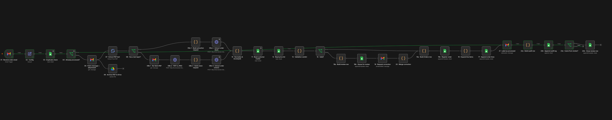
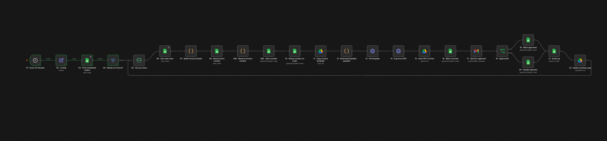

# Order-to-Invoice Automation

Document-driven order intake and invoicing, built on self-hosted infrastructure with a local language model and no third-party AI service.

A purchase order arrives as a PDF attachment. The system extracts it, reconciles the figures against the document's own arithmetic and against master data, registers the order, and — once fulfilment is confirmed — issues a numbered tax invoice, files it, and holds it for human approval before it can reach a customer.

**55 nodes across two workflows.** South African commercial context throughout: ZAR, 15% VAT, `Africa/Johannesburg`.

---

## The engineering problem

Every pipeline built around a language model has an unreliable component at its centre. Extraction is the easy part; the difficulty is constructing a system in which a wrong answer becomes a *caught* answer rather than a wrong invoice.

The design resolves to a single principle:

> **Fix what is provable. Escalate what is ambiguous.**

A purchase order is internally redundant — it states the same facts more than once. `qty × unit_price` must equal the printed line total; the sum of line totals must equal the printed subtotal; the subtotal plus VAT must equal the printed grand total. Three independent statements of the same commercial reality.

That redundancy is the substrate the validation is built on. Where the document contradicts itself in a way arithmetic can resolve, the system repairs the field and verifies the repair against a second printed value. Where the contradiction is genuine, no amount of inference should settle it, and the order is routed to a person.

---

## System architecture

```
┌──────────────┐         ┌──────────────────────────────────────┐
│    Gmail     │────────▶│  n8n  (Docker, self-hosted)          │
│ orders/inbox │  poll   │                                      │
└──────────────┘  1 min  │   WF1 · Order Intake & Validation     │
       ▲                 │   WF2 · Invoice & Approval            │
       │ approval        │                                      │
       │ + review        └───┬──────────┬──────────┬─────────────┘
       │ (suspend/resume)    │          │          │
       │                     │          │          │
       │            ┌────────▼───┐ ┌────▼─────┐ ┌──▼────────────┐
       └────────────│  Ollama    │ │  Google  │ │ Google Drive  │
                    │ gemma3:4b  │ │  Sheets  │ │  PDF archive  │
                    │ :11434     │ │ 7 tabs   │ │  + invoices   │
                    └────────▲───┘ └──────────┘ └───────────────┘
                             │
                    ┌────────┴────────────┐
                    │ pdf2img service     │   host-side, :8099
                    │ PDF → JPEG (sips)   │   scanned documents only
                    └─────────────────────┘
```

Everything inside the dashed boundary runs on one machine. No document, order value or customer record is sent to a third-party model provider.

**Why the PDF converter is a separate service.** The n8n container is a Docker Hardened Image with no package manager, so poppler and ImageMagick cannot be installed inside it. Rather than fight the image, the conversion runs on the host as a dependency-free Python service and is called over `host.docker.internal` — exactly the way n8n already reaches Ollama. One pattern, two services, no custom image to maintain.

---

## Data model

Google Sheets is the datastore, and deliberately so: the operations team that would run this already lives in spreadsheets, and every intermediate state is inspectable without a database client.

| Tab | Grain | Key | Purpose |
|---|---|---|---|
| `Orders` | one row per order | `order_id` | the master record and the work queue |
| `Order Lines` | one row per line item | `line_key` | `order_id`-`line_no`, so re-processing overwrites rather than duplicates |
| `Needs Review` | one row per exception | `review_id` | open items for a human, closed on resolution |
| `Audit Log` | append-only | — | every state transition, with execution id |
| `Customers` | master data | `customer_code` | validation source, not a lookup convenience |
| `Price List` | master data | `sku` | authoritative unit prices |
| `Config` | key/value | `key` | invoice counter, VAT rate, dry-run flag |

### Status flow

```
received → extracted → needs_review → registered → in_progress
                                                        ↓
        approved ← invoiced ← completed ←───────────────┘
             ↑         │
             └─ rejected (terminal; requires human action)
```

**Every stage of the pipeline is a filter on this column.** That is what makes the system restartable: no work is held in an in-flight execution, so any stage can be re-run days later against whatever the sheet currently says. Two transitions are deliberately manual — `registered → completed` represents goods actually being supplied, which no workflow can observe, and `rejected → completed` requires someone to fix the underlying problem first.

### Idempotency

Three keys defend three different things:

| Key | Defends against |
|---|---|
| `gmail_message_id` | the same message being delivered or polled twice |
| `order_id` (= PO number) | the same order arriving as a *different* message |
| `invoice_number`, reserved before generation | one order being invoiced twice after a retry |

The second is the one that is easy to miss. Deduplicating on the message alone catches a retry but not a resend, because a resent purchase order is a genuinely new email carrying an order that already exists.

---

## Pipeline 1 — Order Intake & Validation

Gmail trigger, 32 nodes.



*Left to right: intake and deduplication, then the archive branch forking below. The extraction fork sits centre — the upper path handles native PDFs, the lower path rasterises scanned documents through the host converter before the vision call. Both rejoin at reconciliation. The review branch drops below the main line at the validation gate and rejoins the same registration path, so a corrected order and a clean one are written by identical nodes.*

| Stage | Behaviour |
|---|---|
| **Intake** | Poll the `orders/inbox` label for PDF attachments. Check `gmail_message_id` against `Orders` **before** downloading or invoking the model — duplicates cost one lookup, not one inference. |
| **Archive** | The original PDF is written to Drive before anything parses it, so the source document is always recoverable. |
| **Extraction** | Branch on whether the PDF carries a text layer. Text documents go to the model directly; scanned documents are rasterised by the host service and sent to the same model as an image. Both branches emit an identical schema. |
| **Reconciliation** | Recompute every line, cross-check against the printed figures, repair what arithmetic can prove, and record what was repaired. |
| **Validation** | Match every customer and SKU against master data. Collect *all* failures rather than short-circuiting on the first, so a reviewer sees the full picture in one pass. |
| **Registration** | Write the order and expand its line items, keyed for overwrite rather than append. |
| **Exception path** | Queue the exception, email a reviewer, and **suspend the execution**. On submission the run resumes, merges the corrections, re-validates, and rejoins the identical registration path. |
| **Close-out** | Label the message processed, close the review item, write the audit row. |

## Pipeline 2 — Invoice & Approval

Schedule trigger, 23 nodes.



*A single linear chain, deliberately. Invoice numbering sits at the centre — reserved and written to the order before the template is copied, so a failure downstream cannot produce a second number. The approval gate near the end splits to the approved and rejected paths, which converge on one audit node before the working copy is deleted and the loop returns to the batch node for the next order.*

| Stage | Behaviour |
|---|---|
| **Selection** | Every 15 minutes, select orders at `completed` with no invoice number. The filter is the idempotency guarantee — an overlapping run finds nothing to do. |
| **Iteration** | Process one order at a time so a failure is scoped to a single record. |
| **Numbering** | Reserve the invoice number and write it to the order **before** any document is generated. |
| **Generation** | Copy the invoice template, populate it in a **single** Sheets `values:batchUpdate` request, and export to PDF with explicit print parameters. |
| **Delivery** | File the PDF to Drive, stamp the order `invoiced`, and **suspend** pending approval. |
| **Resolution** | Approve, or park as `rejected` with the reviewer's reason. Audit either outcome, delete the working copy, continue the loop. |

---

## Design decisions

**Deterministic inference.** `temperature: 0` does not make Ollama reproducible; the same payload returned correct JSON, correct JSON with one wrong quantity, and an empty object across successive runs. Pinning `seed` and `top_k: 1` alongside it produced byte-identical output over four consecutive runs. Non-determinism in a validation pipeline is not a quality issue but a *reproducibility* issue — a fault that will not repeat cannot be diagnosed.

**Direct model invocation rather than a framework node.** n8n's structured-extraction node wraps the caller's schema in its own prompt scaffolding, which a 4-billion-parameter model does not survive: it returned a quantity of `80` lifted from the string `80gsm` in a product description. The same model, given the same text through a direct API call, returned the correct value every time. Calling the API directly also makes the text and vision branches structurally identical — they differ by one array.

**Invoice numbers reserved before generation.** If document generation fails and the run is retried, the order already owns its number and cannot be issued a second one. Rejected invoices retain their number and it is void, never reused. The gap in the sequence is itself part of the audit trail.

**One batch write instead of six sequential ones.** Populating the invoice template is a single `values:batchUpdate` request assembled in code: one round trip, one failure point, one retry semantic.

**Two workflows, decoupled through the datastore.** The pipelines are not wired together. Intake writes a status; invoicing polls for it. Either can be modified, broken or re-run without touching the other, state survives restarts, and invoicing can be replayed against orders processed a week earlier.

**Rejection is terminal.** A rejected invoice is not automatically re-issued. A human rejected it because something upstream is wrong, and a machine cannot resolve that by trying again — an automatic retry on a human rejection is a loop, not a feature.

---

## Measured extraction accuracy

The same schema and prompt, against the same purchase order in two formats:

| | Native PDF (text layer) | Scanned image |
|---|---|---|
| PO number, dates, customer, VAT number | Correct | Correct |
| Line items and quantities | Correct | Correct |
| Unit prices | Correct | **2 of 3 invented** |
| Subtotal / VAT / total | Correct | **Leading digits dropped** — `8 424.00` read as `824.00` |
| Round trip | ~45 s | ~90 s |

The failure mode on scanned input is instructive: the South African thousands separator is a space, and the vision model does not hold the grouping together. The sample data retains that convention deliberately, because it produces an honest failure this system exists to catch.

**Every one of those five errors was caught downstream** — invented prices by the price-list comparison, dropped digits by the subtotal reconciliation. The order was routed for human review, which is the correct outcome. Scanned documents are additionally treated as low-confidence by policy and require a price-list match on every line.

---

## Failure handling

| Failure | Response |
|---|---|
| Model returns unparseable output | Retry, then route to review rather than registering a partial record |
| Quantity contradicts the printed line total | Repair arithmetically if the division is exact; verify against the subtotal; otherwise escalate |
| Printed subtotal contradicts the line items | Escalate — the document disagrees with itself and inference cannot settle it |
| Unknown customer or SKU | Escalate with the specific value that failed to match |
| Duplicate message | Skip before download and before inference |
| Order with no line items | Refuse to invoice; a blank invoice is worse than an error |

---

## Repository layout

```
workflows/     both pipelines, exported and sanitised of instance identifiers
sample-data/   generator, master data, and 10 purchase orders
tools/         host-side PDF converter; export sanitiser
```

### Sample data

`sample-data/generate_sample_data.py` is the single source of truth — re-running it regenerates every artefact. It produces real PDFs with a text layer via `reportlab`, and rasterises one through `Pillow` to produce a document with no text layer at all.

Ten purchase orders: four clean, six carrying exactly one defect each.

| File | Defect | Expected routing |
|---|---|---|
| `01`–`04` | none | registered |
| `05` | no PO number on the document | review |
| `06` | subtotal understated by R1 200 | review |
| `07` | buyer absent from customer master | review |
| `08` | byte-different resend of order 01 | no second record |
| `09` | scanned, no text layer | vision branch |
| `10` | SKU absent from price list | review |

All companies, individuals, VAT numbers and the supplier entity are fictional.

---

## Running it

**Prerequisites** — Docker; [Ollama](https://ollama.com) with `gemma3:4b`; a Google account with the Gmail, Sheets and Drive APIs enabled and an OAuth client; Python 3 with `reportlab` and `Pillow` if regenerating sample data.

1. Create the datastore spreadsheet with the seven tabs, importing the headers from `sample-data/sheets/` and loading `customers.csv` and `price_list.csv`.
2. Create a separate invoice template spreadsheet — Pipeline 2 copies it per invoice.
3. Create the Gmail labels `orders/inbox` and `orders/processed`, with a filter applying the former on arrival.
4. Import both workflows, replace the `YOUR_SPREADSHEET_ID`, `YOUR_SHEET_GID` and `you@example.com` placeholders, and attach your own credentials.
5. Start the converter: `python3 tools/pdf2img_service.py`. The vision branch depends on it.
6. Email a sample purchase order to the monitored address.

`tools/sanitise_export.py` strips instance identifiers, credential ids and — importantly — any pinned node data from an n8n export before publication. Pinned nodes store captured output verbatim, which for this pipeline means live message bodies.

### Operational notes

Built and measured on a 2019 Intel MacBook Pro, where Ollama has no GPU path and runs entirely on CPU: 40–60 seconds per extraction, and HTTP nodes calling the model need their timeout raised to 300 000 ms. On Apple Silicon or a GPU host, expect substantially faster. Model choice reflects that constraint — a 4B model at three times the speed of a 9B, with no measured accuracy loss on text extraction.

On Linux, substitute `pdftoppm` for the macOS `sips` call in the converter.

---

## Status

Both pipelines run end to end. The edge-case verification suite — confirming each of the six deliberate defects routes as specified above — is in progress, and results will be published here when recorded.

---

## Licence

MIT — see [LICENSE](LICENSE).
